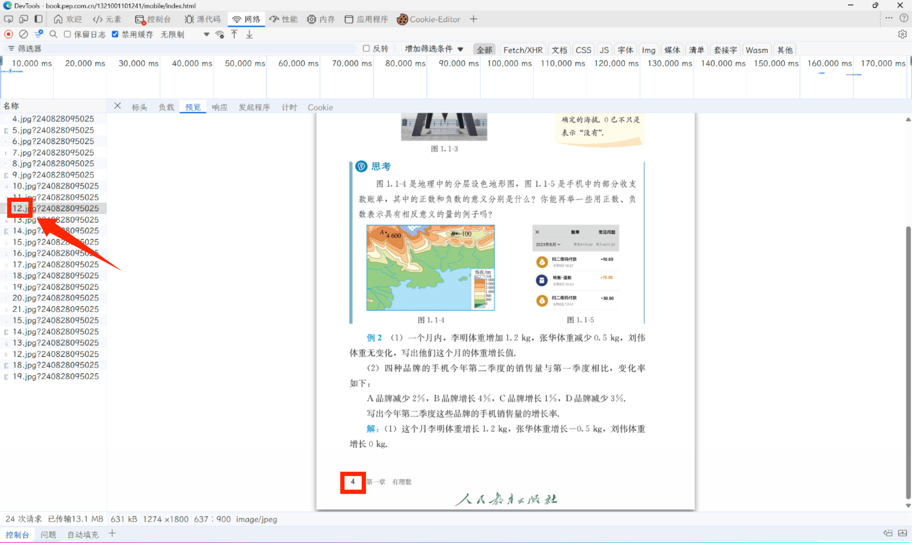

# PEP High School Book Downloader

一个用于下载人教版中小学电子教材的Python工具。

## 功能特点

- 批量下载人教版电子教材页面图片
- 支持自定义下载页面范围
- 自动处理请求头和Cookie
- 错误处理和重试机制
- 实时显示下载进度

## 系统要求

- Python 3.6+
- requests库

## 安装

### 使用pip安装

```bash
pip install requests
```

### 或者从源码安装

```bash
git clone https://github.com/006lp/PEP-High-School-Book-Downloader.git
cd PEP-High-School-Book-Downloader
pip install -r requirements.txt
```

## 使用方法

### 1. 获取教材信息

首先需要通过浏览器开发者工具获取以下信息：

1. 打开[人教版电子教材网站](https://jc.pep.com.cn/)
2. 选择需要下载的书籍
3. 按`Ctrl + Shift + I`（Edge）打开开发者工具
4. 切换到Network标签
5. 随便翻动几页，图片请求
6. 复制以下信息：
   - 图片URL
   - Referer头部
   - Cookie中的`acw_sc__v3`值

### 2. 配置参数

在代码中修改以下参数：

```python
# 页面范围设置
start_page = 6   # 开始页码，注意此页数是包含封面扉页的，并不是书籍下标
stop_page = 31   # 结束页码，注意此页数是包含封面扉页的，并不是书籍下标

# 网络请求配置
base_url = "https://book.pep.com.cn/xxxxxxxxxxxx/files/mobile/{}.jpg?xxxxxxxxxxxx"
referer = "https://book.pep.com.cn/xxxxxxxxxxxxx/mobile/index.html"
acw_sc__v3 = "your_cookie_value_here"
```

### 3. 运行程序

```bash
python main.py
```

## 配置说明

### 页面范围配置

- `start_page`: 开始下载的页码（包含封面扉页）
- `stop_page`: 结束下载的页码

**注意**: 页码是包含封面扉页的总页数，不是书籍内容的页码。

### 网络请求配置

- `base_url`: 图片URL模板，其中`{}`会被页码替换
- `referer`: HTTP Referer头部，通常是教材的主页URL
- `acw_sc__v3`: Cookie中的安全验证值

## 示例
<details>
以七年级上册数学为例，下载目录页到第一章末：
<center>

</center>

> `base_url`将对应第一行的数字替换成`{}`即可
> 
> `start_page`&`stop_page`具体值请自行换算
> <details>
> <summary>例如示例中书下角标第4页实际上是12.jpg
> 


```python
start_page = 6
stop_page = 31
base_url = "https://book.pep.com.cn/1321001101241/files/mobile/{}.jpg?240828095025"
referer = "https://book.pep.com.cn/1321001101241/mobile/index.html"
acw_sc__v3 = "686a0adb9f209e20d77559ecb9d0b5a66355e4c3"
```

### 输出

下载的图片会保存在 `downloaded_images` 文件夹中，文件名格式为：
- `image_06.jpg`
- `image_07.jpg`
- ...

</details>

## 注意事项

1. **合法使用**: 本工具仅用于个人学习和研究目的，请遵守相关法律法规和网站使用条款。

2. **Cookie有效期**: acw_sc__v3值有一定的有效期，如果下载失败，请重新获取。

3. **请求频率**: 程序内置了0.5秒的请求间隔，避免对服务器造成过大压力。

4. **网络环境**: 确保网络连接稳定，某些地区可能需要特殊的网络环境。

## 故障排除

### 常见错误

1. **403/404错误**: 检查URL和Cookie是否正确
2. **网络超时**: 检查网络连接，可能需要重试
3. **Cookie过期**: 重新获取acw_sc__v3值

### 获取Cookie的详细步骤

1. 打开Chrome/Firefox浏览器
2. 访问人教版教材网站
3. 按F12打开开发者工具
4. 切换到Network标签
5. 刷新页面
6. 找到图片请求，查看Request Headers
7. 复制Cookie中的acw_sc__v3值

## 贡献

欢迎提交Issue和Pull Request来改进这个工具。

## 许可证

AGPL v3

## 免责声明

本工具仅供学习和研究使用，使用者应当遵守相关法律法规和网站使用条款。开发者不承担因使用本工具而产生的任何法律责任。